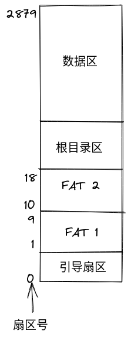

### FAT12 file system

FAT12是DOS时代的早期文件系统，结构简单，一直沿用于软盘。

##### 文件系统分配图

##### 引导扇区

| 名称 | 偏移 | 长度 | 内容 | 本系统引导数据 |
| ----|------|-----|------|----------------|
| BS_jmpBoot | 0 | 3 | 跳转指令 | jmp short Label_Start nop |
| BS_OEMName | 3 | 8 | 生产厂商名 | 'MINEboot'|
| BPB_BytesPerSec | 11 | 2 | 每扇区字节数 | 512 |
| BPB_SecPerClus| 13 | 1 | 每簇扇区数 | 1 |
| BPB_RsvdSecCnt | 14 | 2 | 保留扇区数 | 1 |
| BPB_NumFATs | 16 | 1 | FAT表份数| 2 |
| BPB_RootEntCnt | 17 | 2 | 根目录可容纳的目录项数 | 224 |
| BPB_TotSec16 | 19 | 2 | 总扇区数 | 2880 |
| BPB_Media | 21 | 1 | 介质描述符 | 0xF0 |
| BPB_FATSz16 | 22 | 2 | 每FAT扇区数 | 9 |
| BPB_SecPerTrk | 24 | 2 | 每磁道扇区数 | 18 |
| BPB_NumHeads | 26 | 2 | 磁头数 | 2 |
| BPB_HiddSec | 28 | 4 | 隐藏扇区数 | 0 |
| BPB_TotSec32 | 32 | 4 | 如果BPB_TotSec16值为0，则由这个值记录扇区数 | 0 |
| BS_DrvNum | 36 | 1 | int 13h的驱动器号 | 0 |
| BS_Reserved1 | 37 | 1 | 未使用 | 0 |
| BS_BootSig | 38 | 1 | 扩展引导标记(29h) | 0x29 |
| BS_VolID | 39 | 4 | 卷序列号 | 0 |
| BS_VolLab | 43 | 11 | 卷标 | 'boot loader' |、
| BS_FileSysType | 54 | 8 | 文件系统类型 | 'FAT12' |
| 引导代码 | 62 | 448 | 引导代码/数据及其它信息 | boot.asm |
| 引导扇区结束标志 | 510 | 2 | 引导扇区结束标志 | 0xAA55 |

##### FAT表项 

FAT12表项占12位，FAT16表项占16位，FAT32表项则占32位

| FAT项 | 实例值 | 描述 |
| --- | --- | --- |
| 0 | FF0h | 磁盘标识字 ,低字节与BPB_Media数值保持一致 |
| 1 | FFFh | 第一个簇已经被占用 |
| 2 | 003h | 可用簇 | 
| 3 | 004h | 已用簇,标识下一个簇的簇号 |
| ... | .... | FF0h - FF6h : 保留簇 |
| N | FFFh | FF7h:坏簇 |
| N+1 | 000h | FF8h ~ FFFh : 文件的最后一个簇 |

##### 根目录项

| 名称 | 偏移 | 长度 | 描述 |
| --- | --- | --- | --- |
| DIR_Name | 0x00 | 11 | 文件名8B,扩展名3B |
| DIR_Attr | 0x0B | 1 | 文件属性 |
| 保留 | 0x0C | 10 | 保留位 |
| DIR_WrtTime | 0x16 | 2 | 最后一次写入时间 |
| DIR_WrtDate | 0x18 | 2 | 最后一次写入日期 |
| DIR_FstClus | 0x1A | 2 | 起始簇号 |
| DIR_FileSize | 0x1C | 4 | 文件大小 |

