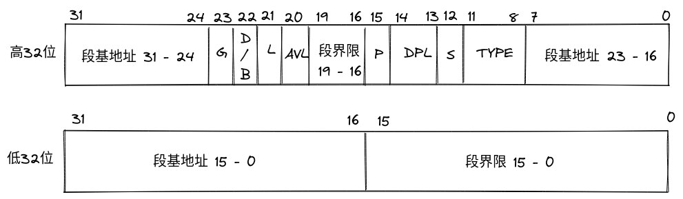
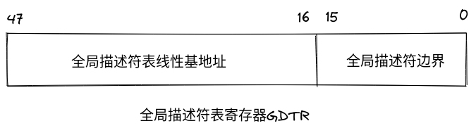

### 实模式

### 保护模式

#### 全局描述符GDT

保护模式下，内存访问通过描述符来进行，段描述符在GDT中定义；其中第一个描述符需要全为0；

段描述符格式（8字节）如下:

段描述符说明：

* G位：粒度位，G=0，段界限以字节为单位，此时段范围为1Byte-1M;G=1,段界限以4KB为单位，此时段范围4KB-4G。

* S位：S=0代表为系统段；S=1代表为代码段或者数据段。
* DPL：描述符的特权级，0，1，2，3，其中0为最高特权级，3为最低。
* P：段存在位，P=0代表段描述符虽然建立，但是内存段还不存在;P=1代表内存段已经存在；P位是由处理器负责检查的，如果P=0，则会产生一个异常中断，通常情况下，该中断处理过程由操作系统负责把该段从硬盘换回内存。
* D/B位：默认操作数大小，为了在32位处理器兼容运行16位程序，对于代码段，D=0代表指令中的偏移地址或者操作数是16位，D=1则代表是32位偏移地址或者操作数；即使用IP或者EIP来取指令的区别；对于栈段，是使用SP或者ESP的区别。
* L位：64位代码段标志。
* TYPE：指示描述符的子类型，对于数据段这四位分别为：X，E，W，A；对于代码段来说，四位分别为：X，C，R，A；其中共同的A位代表是否已访问，初始值为0,当该段被访问时会自动由处理器将该位置为1，用于统计段的使用频率，内存空间紧张时，可以把不经常使用的段退避到硬盘上，从而实现虚拟内存管理。
    - 数据段：

    | X | E | W | A | 含义 |
    | ---- | ---- | ---- | ---- | ----|
    | 0 | 0 | 0 | X | 只读 |
    | 0 | 0 | 1 | X | 读，写 |
    | 0 | 1 | 0 | X | 只读,向下扩展 |
    | 0 | 1 | 1 | X | 读，写，向下扩展 |

    - 代码段：

    | X | C | R | A | 含义 |
    | ---- | ---- | ---- | ---- | ----|
    | 1 | 0 | 0 | X | 只执行 |
    | 1 | 0 | 1 | X | 读，执行 |
    | 1 | 1 | 0 | X | 只执行,依从的代码段 |
    | 1 | 1 | 1 | X | 读，执行，依从的代码段 |

    - 依从的代码段：C=1代表依从的代码段，表示允许从低特权级的代码转移到该段执行，C=0代表非依从代码段，表示代码段只能与他同级别的代码段调用或者通过门调用。

* AVL：不知道干嘛用的

#### 全局描述符寄存器GDTR

GDTR保存了GDT的基地址及GDT长度范围；全局描述符的界限值为表实际长度-1，如果GDT表长度为0，表示表长度为1；使用lgdt指令将内存中的数据加载进GDTR；

#### 段选择子

段选择子从0开始，0即为选择的第一个段选择子（但是其实第一个段选择子全为0，不使用）